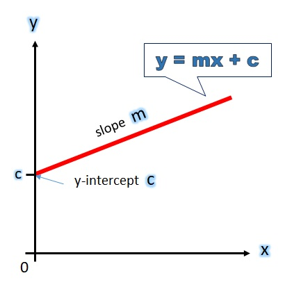
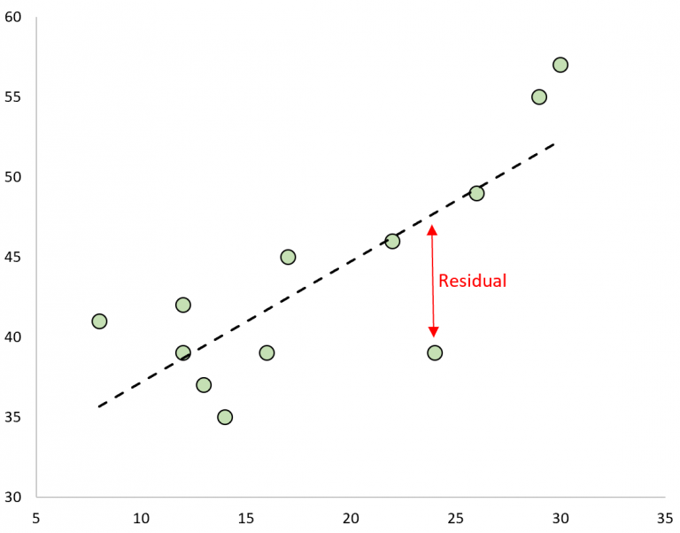

# Libraries
```{r}
#install.packages('tidyverse')
#install.packages(readr)
library("readr")
library(ggplot2)
```

# Load CSV
```{r}
IrisDataset <- read.csv('cars.csv')
```

# 1. EDA 
## 1.1 Knowing the data
```{r}
# To list the attributes of the data set.
attributes(cars)
# To print the min, max, mean, median, and quartiles of each attribute.
summary(cars)
# To display the structure of your data set.
str(cars) 
# To get th names of the attributes within your data set.
names(cars) 
```

## 1.2 Some Plots
### Variable: SPEED
```{r}
hist(cars$speed, 
     main="Speed distribution", xlab="Speed [mph]") 
```

A Histogram reveals that the most frequent speed of cars is between 10 to 20. 

### Variable: STOPPING DISTANCE
```{r}
hist(cars$dist, 
     main="Stopping distance distribution", xlab="Stopping Distance [feet]")
```

The most frequent distance of most cars is between 20 to 40. 

```{r}
ggplot(data = cars, aes(x = "", y = dist)) + 
  geom_boxplot()+ theme_classic()+ 
  xlab("")+ylab("Stopping Distance [feet]")
```  

A histogram doesn't reveal much data. 

```{r}
ggplot(data = cars, aes(x = "", y = dist)) + 
  geom_violin()+ theme_classic()+ 
  xlab("")+ylab("Stopping Distance [feet]")
```

But a Violin plot does!. Now we have a much clear idea of the distribution's shape. 

### Normal Quantile Plot is a way to see if your data is normally distributed.
```{r}
qqnorm(cars$speed) 
qqnorm(cars$dist)
```

We can see that there is a positive correlation btw Speed and Distance

### Scatter plot of Speed vs Distance
```{r}
plot(cars, col='blue', pch=20, cex=2, 
     main="Speed and Stopping Distance for 50 Cars", 
     xlab="Speed [mph]", ylab="Stopping Distance [feet]")
```

There is a clear positive correlation between Speed and Distance. 

## 1.3 Missing Values?
If there are, the summary()) will count how many NA’s you have.
```{r}
summary(cars)
```

Also you can show your NA’s through logical data. (TRUE if it’s missing, FALSE if it’s not.)

```{r}
#is.na(cars) 
```

For a compact version, the any() function could be used. 
```{r}
any(is.na(cars))
```


Replace the missing values with the mean, which is common technique, but **something to use with care with as it can skew the data**.
```{r}
#DatasetName$ColumnName[is.na(DatasetName$ColumnName)]<-mean(DatasetName$ColumnName,na.rm = TRUE)
```


# 2. Testing and Training Sets

First of all, define a seed to get *reproducible experiments*. 
```{r}
set.seed(122)
```

These two lines calculate the sizes of each set *but do not create* the sets:
```{r}
trainSize<-round(nrow(cars)*0.7) # 70/30%
testSize<-nrow(cars)-trainSize
```

Just to check the dimension of the vectors.
```{r}
print(trainSize)
print(testSize)
```


How do you create the **train/test sets**?. We also want these sets to be in a randomized order, which will help to create an optimal model. To perform this, you need to run these three lines of code. 
```{r}
training_indices<-sample(seq_len(nrow(cars)),size =trainSize)
trainSet<-cars[training_indices,]
testSet<-cars[-training_indices,]
```

# 3. Linear Regression 
The next step is to predict the cars stopping distances through the speed of the cars. To do this, we’ll be using the prediction function – predict()

* **Input / Independent Variable / Y **: Speed of the cars (speed)
    
* **Output / Dependent Variable / X **: Stopping distances (distance)


A regression model of *first grade*, can be defined by the equation of a straight line.



Replacing some values
$$ Distance = slope * Speed + y.intercept$$ 

The syntaxis on R is quite straightforward  $lm(Y ~ X, dataset)$ where **lm** stands for *linear model*.

In this particular problem is important to understand the physics behind it. I don{t know which will be the stopping distance of a car at a certain velocity. But if the car has velocity = 0, the stopping distance also **must be** equal to 0. To force that the y-interception term must be modified to $ 0 + y.intercept $ 

Finally, to avoid **overfitting**, we use the **Train Set** to fit the model. 

```{r}
# The basic line of code for the linear model function. 
cars_regression <-lm(dist ~  0 + speed, trainSet)
```

thats all!. Now to see the metrics of the model, just call **summary()**
```{r}
summary(cars_regression)
```


## 3.1 Predictions

To make predictions, we use the **Test Set**.
```{r}
cars_predictions <- predict(cars_regression, testSet)
cars_predictions
```

**Confidence in your predictions**: In order to have an idea about the accuracy of the predictions, you can ask for intervals around your prediction. 

```{r}
predict(cars_regression,testSet, interval='confidence')

```

To get a matrix with **the predictions and a 95 percent confidence interval around the mean prediction**, you set the argument interval to ‘confidence’ like this:
```{r}
predict(cars_regression,testSet, interval='prediction')
```

## 3.2 Fitting a line

As we used a model with a first grade equation, the parameters that define the line that fits our model are 2, **slope** and **y-Intersection**. In this case there is only one value because y-intercept was forced to be equal to 0. 
```{r echo=FALSE}
cars_regression
```

So, now we can plot both, the dots of our data, and the line that fits them.  

```{r}
plot(trainSet, col='blue', pch=20, cex=2, 
     main="Speed and Stopping Distance for 50 Cars", 
     xlab="Speed [mph]", ylab="Stopping Distance [feet]")

abline(cars_regression)
```

## 3.3 Residual plots

A residual is the difference between an observed value and a predicted value in regression analysis.

It is calculated as: $Residual = Observed.Value – Predicted.Value$



To get the residuals of out model
```{r}
res <- resid(cars_regression)
```


```{r}
#produce residual vs. fitted plot
plot(fitted(cars_regression), res)

#add a horizontal line at 0 
abline(h = 0, col = "gray60")
```


