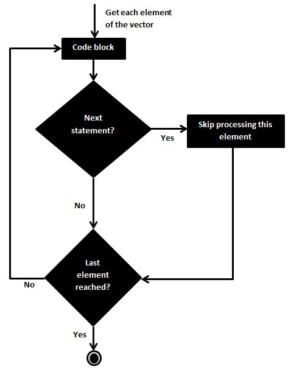

# **Exercise 1** 
#### Write a for loop that iterates over the numbers 1 to 7 and prints the cube of each number using print().
```{r}
rm(list = ls()) # clean and remove all the values of the environment

vec_num <- 1:7
for (i in vec_num) {
  print(i^3)
}
```


# **Exercise 2**
#### Write a for loop that iterates over the column names of the inbuilt iris dataset and print each one together with the number of characters in the column name in parenthesis. Example output: Sepal.Length (12). Use the following functions **print()**, **paste0()** and **nchar()**.
```{r}
rm(list = ls())

for (i in colnames(iris)) {
  print(paste0(i,' ','(',nchar(i),')'))
}
```


# **Exercise 3**
#### Write a while loop that prints out standard random normal numbers (use **rnorm()**) but stops (breaks) if you get a number bigger than 1.
```{r}
rm(list = ls())

k <- rnorm(1)
while (k < 1) {
  print(k)
  k <- rnorm(1)
}
```

# **Exercise 4**
#### Using **next** adapt the loop from the last exercise so that it doesn't print negative numbers.

Below, a flow diagram of the **next** statement. And more info could be found [here](https://www.tutorialspoint.com/r/r_next_statement.htm)


```{r}
rm(list = ls())


while (TRUE) 
  {
  k = rnorm(n=1)
  if (k < 0) {next}
  if (k > 1) {break}
  print(k)
  }
```


# **Exercise 5**
#### Using a for loop, simulate the flip of a coin twenty times, keeping track of the individual outcomes (1 = heads, 0 = tails) in a vector that you predefined.

```{r}
rm(list = ls())

indiv_outcomes <- integer() # stores a vector with a succession of index outcome index outcome etc...
n_flips = 20
i <- 1
heads <- 0 #heads = 1
tails <- 0 #tails = 0

#simulate the flip o the coin
for (i in 1:n_flips){
  coin <- floor(runif(1, min=0, max = 2))
  indiv_outcomes <- c(indiv_outcomes, i, coin)
  if (coin == 0) {heads = heads + 1}
  else {tails = tails + 1}
  
  i <- i +1
}

#create a matrix to store the index/outcome of the simulation
coin_simulation <- matrix(indiv_outcomes, nrow = n_flips, ncol = 2, byrow = TRUE)

print(paste0('Heads', ' ',heads))
print(paste0('Tails', ' ',tails))
print(coin_simulation)
```


# **Exercise 6**
#### Use a nested for loop (a for loop inside a for loop) that produces the following matrix, preallocate the matrix with NA values.
    0     1     2     3     4
    1     0     1     2     3
    2     1     0     1     2
    3     2     1     0     1
    4     3     2     1     0

```{r}
rm(list = ls())

cols = 5
rows = 5
j = 1 # contador col
i = 1 # contador row
p = 0
mx <- matrix(nrow = rows, ncol = cols) # creates a matrix full of NA (or empty)

for (i in 1:rows){
  for (j in 1:cols) {
    mx[i,j] <- abs(i-j)
  }
}

print(mx)
```


# **Exercise 7**
#### Use a while loop to investigate the number of terms required before the product
1⋅2⋅3⋅4⋅…
reaches above 10 million.

Explanation: which i do you need for the product of the first i natural integer numbers to exceed 10 million? EG how many terms do you need to exceed 100? 1⋅2⋅3⋅4 = 24, 1⋅2⋅3⋅4⋅5=120 then the answer is 5.

```{r}
rm(list = ls())

limit = 10000000
n = 1 
i = 1

while (TRUE) {
  n <- i * n
  if (n >= limit) {break}
  i <- i + 1
}
print(paste('the number of terms required to reach ',limit,' is ',i))
```


# **Exercise 8**
#### Use a while loop to simulate one stock price path starting at 100 and random normally distributed percentage jumps with mean 0 and standard deviation of 0.01 each period. How long does it take to reach above 150 or below 50?


```{r}
rm(list = ls())

price <- 100
limit_High <- 150
limit_Low <- 50

n_periods <- 0 
u_mean <- 0
u_std <- 0.01  #standard deviation 

#colnames = c('period', 'variation', 'price')
mx <- matrix(ncol = 3, byrow = TRUE) # , dimnames = list(colnames())

list_to_matrix <- list()
variations <- c()
prices <- c()

while (TRUE){
  variation <- rnorm(1, mean = u_mean, sd = u_std)
  price <- (price * variation) + price
 
  variations <- c(variations, variation)
  prices <- c(prices, price)
  
  
    if (price > limit_High) {
    print(paste('Upper Limit Reached: $', price, ' in ',n_periods, ' periods'))
    break
  }
  if (price < limit_Low) {
    print(paste('Lower Limit Reached: $', price, ' in ',n_periods, ' periods'))
    break
  }
  n_periods <- n_periods+1
}


plot.ts(prices, ylim = range(c(prices, variations)), col = 'green')
par(new = TRUE)
plot.ts(variations, type = "l", axes = FALSE, bty = "n", xlab = "", ylab = "", col='red')
axis(side=4, at = pretty(range(variations)), col = "red")
mtext("variations", side=4, line=3)

```

<ins> Note: </ins> dual axes plots are very confusing, In this case I tried to plot the track of the **prices, in green** and the track of the **variations, in red**. Perhaps, just plotting the mean of all the variations could be enough and produce a cleaner output. 

# **Exercise 9**
#### Implement a simple version of Guess the number game using a while loop. The user should guess a number between 1 and 10, you can use scan() or readline() to get user input. The loop should break if the user guesses 5.

```{r eval=FALSE}
rm(list = ls())


while (TRUE) {
  print('Human, guess a number between 1 and 10. write your guess:')
#  guess <- readline('Human, write your guess: ')
    guess <- scan('')
  if (guess == 5) {break}
  else {print('still trying!')}
}
print('you guess it!!')

```


# **Exercise 10**
#### Implement a multiplication game. A while loop that gives the user two random numbers from 2 to 12 and asks the user to multiply them. Only exit the loop after five correct answers. Try using as.integer(readline()) instead of scan() this time.

```{r eval=FALSE}
rm(list = ls())

#correct_answers <- '*****'
correct_answers <- 5

while (correct_answers >1) {
  
  num1 <- floor(runif(1, min=2, max = 12))
  num2 <- floor(runif(1, min=2, max = 12))
  answer <- num1 * num2
 # print(paste("what's the result of doing: ",num1,' * ',num2,' ?'))
  print(paste('still need ',correct_answers,' correct_answers') )
  guess <- as.integer(readline(paste("what's the result of doing ",num1,' x ',num2,' ?:  ')))
  if (guess == answer) {
    print('Great!')
    correct_answers = correct_answers - 1
  }
  else {print('PRRRRRR')}
}
print('HURRAY!')
```


# **Exercise 11 Random walker exercise**

#### A random walker that goes up or down with probability of 0.5. start point=0. Eg the first random walker series can be 0,1,2,1,2,1,2,3,4,5,4,5,4,3,2,1,2, etc. The length of each series must be asked to the user and input by him (see prompt function)
Simulate many random walkers and plot them all in the same graph with different colours.
What's happening?

```{r}
rm(list = ls())

point <- 0
steps = 10000
x <- c()
time_series1 <- c()
time_series2 <- c()
time_series3 <- c()

# binomial distribution

for (i in 1:steps){
#random_number <- rnorm((1))  # it's not specifically a proability of 0.5.. it's normally distribuited. 
random_number <- rbinom(1, 1, 0.5)
if (random_number > 0) {slope = 1}
else {slope = -1}
point = point + slope
time_series1 <- c(time_series1, point)
}


point <- 0
for (i in 1:steps){
#random_number <- rnorm((1))  # it's not specifically a proability of 0.5.. it's normally distribuited. 
random_number <- rbinom(1, 1, 0.5)
if (random_number > 0) {slope = 1}
else {slope = -1}
point = point + slope
time_series2 <- c(time_series2, point)
}

point <- 0
for (i in 1:steps){
#random_number <- rnorm((1))  # it's not specifically a proability of 0.5.. it's normally distribuited. 
random_number <- rbinom(1, 1, 0.5)
if (random_number > 0) {slope = 1}
else {slope = -1}
point = point + slope
time_series3 <- c(time_series3, point)
}


plot.ts(time_series1, ylim = range(c(time_series1, time_series2, time_series3)), col = 'red')
par(new = TRUE)
plot.ts(time_series2, ylim = range(c(time_series1, time_series2, time_series3)), col = 'blue')
par(new = TRUE)
plot.ts(time_series3, ylim = range(c(time_series1, time_series2, time_series3)), col = 'green')

# some things to try... create a long vector rnorm(x > 1) and in the for loop decide if it's a 1 or -1. Does it improves the execution time with very large numbers of steps?
```

**Note** How many times will a random walk cross a boundary line if permitted to continue walking forever? A simple random walk  will cross every point an infinite number of times.  [Reference](https://en.wikipedia.org/wiki/Random_walk)

Another interesting publication could be [this](https://rpubs.com/eliisapons/373921)
 

# **Excercise 13**
#### write a function that computes the RMSE of cars

